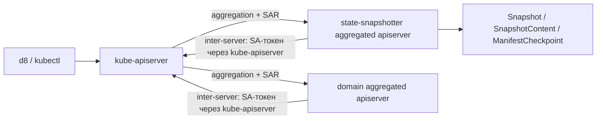
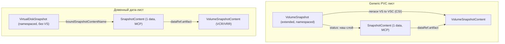
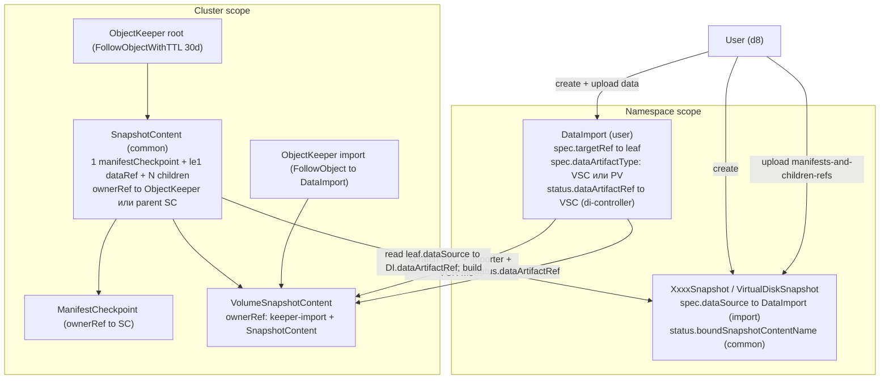
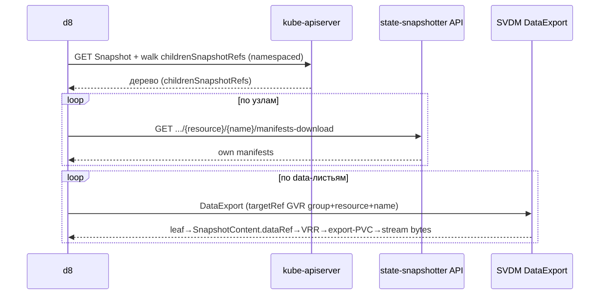
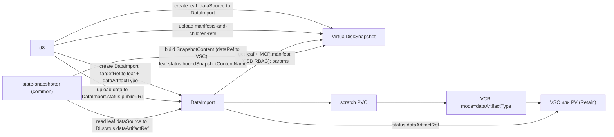
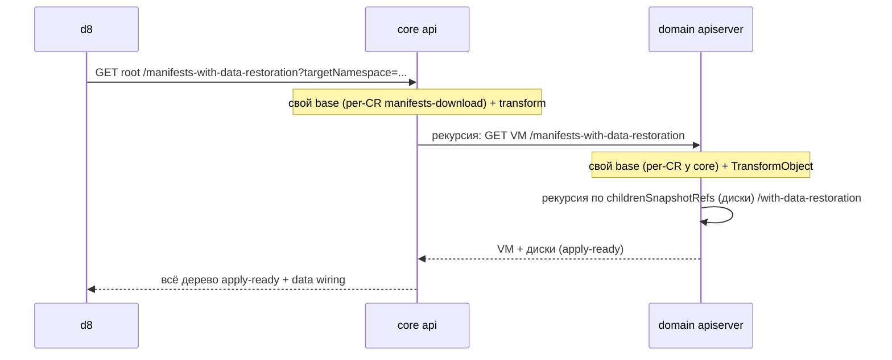
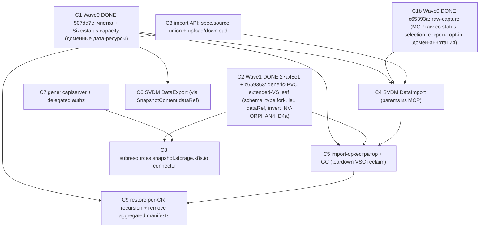

# Единый план: snapshot capture / export / import / restore / GC

Единый источник истины. Чтения этого файла достаточно, чтобы понять **что уже сделано**, **что запланировано** и **почему**. Выровнен по диаграммам [unified-snapshot-detailed.drawio](/Users/azimin/Documents/Flant/deckhouse/arch/architecture-decision-records/dkp/storage/state-snapshotter/unified-snapshot-detailed.drawio) (capture/lifecycle/GC) и [snapshot-import.drawio](/Users/azimin/Documents/Flant/deckhouse/arch/architecture-decision-records/dkp/storage/state-snapshotter/snapshot-import.drawio) (импорт).

Консолидирует 4 плана (этот файл их заменяет как рабочий):
- `domain_controller_separate_binary_0cd98c68` — **ВЫПОЛНЕН** (домен в отдельный бинарь/под).
- `domain_controller_own_module_5a91d3ae` — **ВЫПОЛНЕН** (домен в отдельный Go-модуль).
- `snapshot_export_import_restore_1fe5cbd1` — дизайн-документ (его идеи/схемы влиты сюда).
- `snapshot_flows_remaining_work_2819bd7b` — аудит остатка (влит сюда, см. §9).

Карта документа: §0 что уже сделано · §1 транспорт/API · §2 модель данных и дерево · §3 целевая архитектура (диаграммы) · §4 экспорт · §5 импорт · §6 restore · §7 безопасность · §8 GC · §9 аудит остатка · §10 ветки · §11 порядок коммитов · §12 закрытые решения.

Сквозная идея: **толстый клиент `d8`** (обход CR-дерева, per-CR манифесты, метаданные тома из `status` листьев, `DataImport`/`DataExport`, создание всех снапшот-CR) + **тонкие серверные сабресурсы** (aggregated apiserver: SAR + прокси, без бизнес-логики). Каждый узел дерева бэкается общим cluster-scoped `SnapshotContent`.

## 0. Что уже сделано (фундамент — НЕ переделывать)

Из выполненных планов 1–2. Лежит на ветке `domain-controller-separate-binary` (ahead 11 от `origin/new-controller-model`).

- **Два процесса/пода.** Доменный контроллер вынесен в **отдельный Go-модуль** `images/domain-controller` и **отдельный бинарь/под** (свой manager с отдельным `LeaderElectionID`, scheme demo+storage+v1alpha1+deckhouse+CSI+VCR/VRR, health, свой aggregated apiserver). Core (`state-snapshotter-controller`) — generic-контроллеры + свой aggregated API.
- **Общий контроллер владеет `SnapshotContent` для ВСЕХ kind'ов** (`GenericSnapshotBinderController`, [genericbinder/controller.go](/Users/azimin/Documents/Flant/deckhouse/state-snapshotter/repos/state-snapshotter/images/state-snapshotter-controller/internal/controllers/genericbinder/controller.go)): создаёт + наполняет `status` (manifestCheckpointName/`dataRef` (≤1, singular — Вариант A, C2 `27a45e1`)/childrenSnapshotContentRefs/Ready) из результатов MCR/VCR, ставит ownerRefs + `ObjectKeeper`, и пишет в лист-CR.status binding (`boundSnapshotContentName`); метаданные тома на лист НЕ проецируются (живут в `SnapshotContent.status.dataRef`).
- **Доменный контроллер «тонкий»**: реконсайлит свои снапшот-CR, создаёт MCR/VCR + дочерние снимки, пишет только свои `status`-поля (`manifestCaptureRequestName`/`volumeCaptureRequestName`/`childrenSnapshotRefs`/`HandledByDomainSpecificController`). **`SnapshotContent` не трогает.**
- **D4a (co-write status без SSA).** `demo.status` co-owned двумя НАШИМИ писателями (домен — capture-поля; core — binding/проекция/Ready), запись через **optimistic-lock merge patch** (`MergeFromWithOptimisticLock` под `RetryOnConflict`, read-modify-write только своих полей; full-replace `Update` запрещён). SSA-вариант (D4b) отклонён.
- **Restore-оркестрация.** Единая ручка `manifests-with-data-restoration` на корне ([restore_handler.go](/Users/azimin/Documents/Flant/deckhouse/state-snapshotter/repos/state-snapshotter/images/state-snapshotter-controller/internal/api/restore_handler.go)); core оркестрирует (generic-узлы — из своего `SnapshotContent`; доменные поддеревья — вызов доменного apiserver `RestoreDomainSubtree`); доменный apiserver мутирует **in-process** (`TransformObject`, [restore_transform.go](/Users/azimin/Documents/Flant/deckhouse/state-snapshotter/repos/state-snapshotter/images/domain-controller/internal/controllers/demo/restore_transform.go)), забирая базовые манифесты у core. Отдельного трансформер-сервиса нет; `CSD.manifestTransformation.serviceRef` удалён из контракта (C1 `507dd7e`). (NB: текущая модель — делегирование ЦЕЛОГО доменного поддерева + агрегатный base-fetch у core; по Варианту B restore переводится на рекурсивный per-CR — C9, §6.)
- **Транспорт inter-server.** core↔domain — обычный client-go с **SA-токеном через kube-apiserver** ([domain_restore_client.go](/Users/azimin/Documents/Flant/deckhouse/state-snapshotter/repos/state-snapshotter/images/state-snapshotter-controller/internal/api/domain_restore_client.go), [coreclient.go](/Users/azimin/Documents/Flant/deckhouse/state-snapshotter/repos/state-snapshotter/images/domain-controller/internal/domainapi/coreclient.go)); bespoke mTLS-клиента между подами нет. (Сами серверы пока самописные — `http.ServeMux` + ручной `mTLSMiddleware` (by-hand front-proxy/CN-проверка); штатный front-proxy mTLS aggregation layer при этом сохраняется — миграция на genericapiserver в §11/C7.)
- **GC capture-пути.** root `ObjectKeeper` (`FollowObjectWithTTL`, 30d, [lifecycle_ownerrefs.go](/Users/azimin/Documents/Flant/deckhouse/state-snapshotter/repos/state-snapshotter/images/state-snapshotter-controller/internal/controllers/common/lifecycle_ownerrefs.go)) + цепочка ownerRef (child SnapshotContent → parent SnapshotContent; MCP/VSC → SnapshotContent) + форс `Retain` на VSC.
- **Доменный дата-лист без вложенного VS**: данные через VCR→VSC, бинд через `status.boundSnapshotContentName`.
- **Удалено**: legacy `index/view`, `?node=`/node-id, CRD/контроллеры `SnapshotImport`/`SnapshotExport`.
- **Деплой**: werf-образ `images/domain-controller`, Helm (Deployment/SA/PDB/VPA/APIService), demo-CSD как helm-шаблон (только `snapshotResourceMapping[]`).

## 1. Транспорт и API-поверхность

Цель — **настоящие aggregated apiserver** (genericapiserver) у core и домена. Сейчас core/домен — HTTPS-mux с **самописным** mTLS+CN-allowlist (ручной `mTLSMiddleware` + флаг `--api-allowed-client-cns`, [server.go](/Users/azimin/Documents/Flant/deckhouse/state-snapshotter/repos/state-snapshotter/images/state-snapshotter-controller/internal/api/server.go); requestheader CA читается руками из `extension-apiserver-authentication` в [cmd/main.go](/Users/azimin/Documents/Flant/deckhouse/state-snapshotter/repos/state-snapshotter/images/state-snapshotter-controller/cmd/main.go)) — это by-hand реимплементация штатного RequestHeader-аутентификатора; миграция на genericapiserver — C7.

- **Группы сабресурсов:** `subresources.state-snapshotter.deckhouse.io` (наши/generic-PVC kind'ы), `subresources.<domain>.deckhouse.io` (доменные; эталон `virtualmachines/console` из виртуализации), `subresources.snapshot.storage.k8s.io` (НАША group-version, отдельная от CRD-группы CSI — не перехватывает её): виртуальный `volumesnapshots` БЕЗ хранения (реальные VS — в CSI-CRD), только **connector-сабресурсы — те же, что у наших kind'ов**: `volumesnapshots/<name>/manifests-download` (GET), `/manifests-and-children-refs-upload` (POST), `/manifests-with-data-restoration` (GET); keyed по namespaced имени VS → резолв `VS.status.boundSnapshotContentName → SnapshotContent` и переиспользование тех же хендлеров, что у `subresources.state-snapshotter` (C8).
- **Транспорт (Q10):** все вызовы (user и inter-server) — через kube-apiserver; authn/authz делегированы genericapiserver'у (**requestheader + TokenReview** для authn, **SubjectAccessReview** для authz). Inter-server — SA-токен. Убирается только **самописная** реализация mTLS/CN-allowlist (`mTLSMiddleware` + `--api-allowed-client-cns`); **штатный front-proxy mTLS aggregation layer СОХРАНЯЕТСЯ и обязателен** — extension apiserver валидирует proxy-client-cert kube-apiserver по `requestheader-client-ca-file` + `requestheader-allowed-names` (это и есть CN-allowlist) из ConfigMap `extension-apiserver-authentication`. То есть «убрать mTLS/CN-allowlist» означает убрать ручную копию, а НЕ сам механизм front-proxy.
- **Нормативный контракт aggregation layer (C7 — самый чувствительный блок, поток authn/authz по [официальной доке](https://kubernetes.io/docs/tasks/extend-kubernetes/configure-aggregation-layer/)):** kube-apiserver сперва сам аутентифицирует+авторизует внешний запрос, затем проксирует его в extension apiserver под proxy-client-cert; extension apiserver (1) валидирует, что запрос пришёл от легитимного front-proxy (requestheader-цепочка), и (2) делегирует authorization назад через SubjectAccessReview. Зафиксированные требования: **(a)** регистрация через `APIService` с `caBundle`, `group`/`version`, backing `Service` на порту 443, `groupPriorityMinimum`/`versionPriority`, **без** `insecureSkipTLSVerify` (уже так: [controller/apiservice.yaml](/Users/azimin/Documents/Flant/deckhouse/state-snapshotter/repos/state-snapshotter/templates/controller/apiservice.yaml) и [domain-controller/apiservice.yaml](/Users/azimin/Documents/Flant/deckhouse/state-snapshotter/repos/state-snapshotter/templates/domain-controller/apiservice.yaml) — `groupPriorityMinimum=999`/`versionPriority=15`); **(b)** доступ к `extension-apiserver-authentication` ConfigMap + валидация `--requestheader-client-ca-file`/`--requestheader-allowed-names`; **(c)** RBAC: `extension-apiserver-authentication-reader` (Role в `kube-system`) + `system:auth-delegator` (ClusterRole, SAR/TokenReview). Сейчас reader есть у домена ([domain-controller/rbac-for-us.yaml](/Users/azimin/Documents/Flant/deckhouse/state-snapshotter/repos/state-snapshotter/templates/domain-controller/rbac-for-us.yaml)); при миграции core добавить **оба** binding'а для core и домена.
- **RBAC:** user-facing — per-сабресурс capability-ClusterRole; inter-server — SA-RBAC (core→domain restore; domain→core fetch base).



Эндпоинты (адресация per-CR, без node-id):
- `manifests-download` (GET) — ЭКСПОРТ, **per-CR: манифесты ТОЛЬКО своего узла, НЕ поддерева** (нужно для симметрии с per-CR импортом `...-upload`). Это **новый хендлер (C3)**, отдельный от агрегатного `manifests` (хендлеры `HandleSnapshotAggregatedManifests`/`HandleGenericSnapshotAggregatedManifests` через `BuildAggregatedJSON`/`BuildAggregatedJSONFromSnapshot` — рекурсивный дамп ВСЕГО поддерева, [aggregated_namespace_manifests.go](/Users/azimin/Documents/Flant/deckhouse/state-snapshotter/repos/state-snapshotter/images/state-snapshotter-controller/internal/usecase/aggregated_namespace_manifests.go)), Сейчас агрегатный `manifests` (`BuildAggregatedJSON*`) — inter-server base-fetch доменного restore (`CoreManifestsClient.BaseManifests` → `GET .../<resource>/<name>/manifests`, [coreclient.go](/Users/azimin/Documents/Flant/deckhouse/state-snapshotter/repos/state-snapshotter/images/domain-controller/internal/domainapi/coreclient.go)/[restore.go](/Users/azimin/Documents/Flant/deckhouse/state-snapshotter/repos/state-snapshotter/images/domain-controller/internal/domainapi/restore.go)). **По Варианту B restore переводится на рекурсивный per-CR (C9, §6)**, после чего агрегатный whole-subtree `manifests` + `BuildAggregatedJSON*` + доменный aggregated `BaseManifests` удаляются целиком (§9). per-CR `manifests-download` (single-node) у core резолвит ЛЮБОЙ snapshot-GVK (`boundSnapshotContentName→SnapshotContent→MCP`) и переиспользует `appendObjectsFromManifestCheckpoint` (без рекурсии по детям). Манифесты — из MCP «как лежат», без до-санитизации. **Контракт (C1b): MCP = сырой источник истины** — на capture манифесты кладутся **raw, со `status`** (см. §2); вся field-санитизация — на read-path (restore). C1b (`c65393a`) снял `common.CleanObjectForSnapshot` ([clean.go](/Users/azimin/Documents/Flant/deckhouse/state-snapshotter/repos/state-snapshotter/images/state-snapshotter-controller/internal/common/clean.go)) со snapshot-capture-пути (вызов из [checkpoint_controller.go](/Users/azimin/Documents/Flant/deckhouse/state-snapshotter/repos/state-snapshotter/images/state-snapshotter-controller/internal/controllers/manifestcapture/checkpoint_controller.go) убран) — теперь манифесты кладутся raw, со `status` (раньше резал `status`, у PVC безусловно). Доступен и на `snapshotcontents/<name>` (cluster-scoped, добавляется в C3) — отсюда **DataImport** берёт оригинальный манифест на импорте (DataExport параметры берёт из `SnapshotContent.dataRef`, §5/§7).
- `manifests-and-children-refs-upload` (POST) — ИМПОРТ: один запрос = манифесты узла + список ссылок на прямых детей (childRefs, не сами объекты); **без дескриптора тома** (параметры берутся из манифеста в MCP); НЕ resumable, без `?node=`/`?finalize`.
- `manifests-with-data-restoration` (GET) — ВОССТАНОВЛЕНИЕ, **per-CR рекурсивно (B): свой узел + дети** (§6): **санитизированные** манифесты под `targetNamespace` (вырезаются `status`/managedFields/PVC `spec.volumeName·dataSource` и т.п., [sanitizer.go](/Users/azimin/Documents/Flant/deckhouse/state-snapshotter/repos/state-snapshotter/images/state-snapshotter-controller/internal/usecase/restore/sanitizer.go)) + обвязка восстановления данных.

```bash
# экспорт узла (наша / доменная группы)
kubectl get --raw ".../subresources.state-snapshotter.deckhouse.io/v1alpha1/namespaces/project-a/snapshots/ns-snap/manifests-download"
kubectl get --raw ".../subresources.virtualization.deckhouse.io/v1alpha2/namespaces/project-a/virtualdisksnapshots/my-disk/manifests-download"

# импорт per-CR (CR создан): манифесты + childRefs (параметры тома — из MCP)
kubectl create --raw ".../subresources.virtualization.deckhouse.io/v1alpha2/namespaces/project-a/virtualmachinesnapshots/vm-snap/manifests-and-children-refs-upload" -f vm-snap-payload.json

# restore generic-тома (под targetNamespace)
kubectl get --raw "/apis/subresources.snapshot.storage.k8s.io/v1/namespaces/project-a/volumesnapshots/my-vol/manifests-with-data-restoration?targetNamespace=project-b"
```

## 2. Модель данных и дерево

### Принципы узла (P)
Каждый узел бэкается общим `SnapshotContent` ([snapshotcontent_types.go](/Users/azimin/Documents/Flant/deckhouse/state-snapshotter/repos/state-snapshotter/api/storage/v1alpha1/snapshotcontent_types.go)):
- **манифесты** — ровно 1 `status.manifestCheckpointName` → `ManifestCheckpoint`;
- **данные** — **≤1** `dataRef` → `VolumeSnapshotContent` (на диаграмме поле singular); мультиплет данных — **только дочерними узлами**, не списком;
- **дети** — N `status.childrenSnapshotContentRefs` (рёбра дерева).

Это **Вариант A** (РЕАЛИЗОВАНО в C2, `27a45e1`) — разворот принятого `volume-node-dual-capture` (bulk `dataRefs[] 0..N`): рефактор capture, каждый loose PVC → отдельный дочерний volume-лист, домен-лист = ровно 1 PVC (≥2 на узле структурно невозможно — `dataRef` singular, без generic-декомпозиции), **инверсия INV-ORPHAN4** (orphan-PVC VS перестаёт быть visibility-only и становится реальным content-ребёнком). Затрагивает VCR-планирование, subtree-дедуп по `pvcUID`, two-PVC тесты. Уточнения реализации — §3 Locked «C2 уточнения реализации».

### Бифуркация листьев по типу ресурса
Нижний durable data-артефакт — обычно cluster-scoped **`VolumeSnapshotContent` (VSC)** (Snapshot), для бэкендов без снапшотов — **detached PV** (Detach, см. ниже); различается namespaced-хэндл листа:

**(1) Generic PVC — extended `VolumeSnapshot` (форк СХЕМЫ upstream CRD + форк/патч snapshot-controller).**
- `spec.source` — **форк union'а**: `persistentVolumeClaimName` (capture) | `volumeSnapshotContentName` (legacy pre-provisioned) | **наш `dataImportName→DataImport` (import)**; oneOf расширяем под третий вариант.
- Наш слой в `status`: `status.boundSnapshotContentName` → наш `SnapshotContent` (параллельно легаси `boundVolumeSnapshotContentName` → VSC).
- **Capture:** VSC рождается классическим CSI-путём (`VS→VSC` через сайдкар, `Retain`); общий контроллер пишет `boundSnapshotContentName` D4a-патчем. Затирания нет — форк **Go-типа `VolumeSnapshotStatus`** (его `updateSnapshotStatus` read→DeepCopy(весь status)→UpdateStatus сохраняет известное теперь поле; §3 Q1).
- **Import (единообразно с доменом):** VS создаётся с `spec.source.dataImportName→DataImport`. Форк snapshot-controller **пропускает** такие VS (не реконсайлит), а **общий контроллер биндит сам**: `DataImport.status.dataArtifactRef→VSC` → выставляет `boundSnapshotContentName` + легаси `boundVolumeSnapshotContentName`/`readyToUse` (VS — полноценный снимок).

**(2) Доменные дата-ресурсы (virtual disk и т.п.) — без VS.**
Доменный дата-снимок НЕ содержит вложенного `VolumeSnapshot`. Данные — через **VCR** (capture: PVC→VSC) / **VRR** (restore: VSC→PVC) напрямую (storage-foundation). Биндится к нашему `SnapshotContent` (`status.boundSnapshotContentName`).



### Тип data-артефакта: VSC (Snapshot) vs PV (Detach)
`SnapshotContent.dataRef.artifact` — обычно **VSC** (CSI-снапшот, `VCR.mode=Snapshot`): эффективно, множественный restore, бэкенд умеет снапшоты. Альтернатива — **detached PV** (`VCR.mode=Detach`): когда бэкенд **не поддерживает снапшоты** (нет VolumeSnapshotClass) или нужна семантика «сам том», а не снимок. Тип фиксируется на capture (по способности бэкенда) и **зеркалится на import** через `DataImport.spec.dataArtifactType` (`VolumeSnapshotContent`→`mode=Snapshot`; `PersistentVolume`→`mode=Detach`); d8 берёт тип из бандла. Артефакт (VSC или PV) форсится в `Retain`; restore — единообразно через `VRR(sourceRef=VSC|PV)` (VRR допускает оба источника); GC/teardown-reclaim одинаков (flip→Delete + delete артефакта).

### Метаданные тома (durable)
`storageClassName`/`volumeMode`/`size` (реальный) ДОЛЖНЫ жить в снимке (снимок переживает PVC). `accessModes` отдельно НЕ трогаем — это свойство `PVC.spec`, оно в захваченном манифесте (restore применит из манифеста; scratch-PVC импорта может дефолтить).
- **Export-сторона:** всё уже в `SnapshotContent.status.dataRef` (singular, Вариант A; `SnapshotDataBinding` несёт `artifact→VSC` + storageClass/volumeMode; `Size` из `VSC.status.restoreSize` добавлен в C1 `507dd7e`). DataExport идёт `лист.status.boundSnapshotContentName → SnapshotContent → dataRef` и берёт оттуда и VSC, и параметры. **Отдельного поля на листе не вводим** — лист уже ссылается на SnapshotContent.
- **Import-сторона:** на импорте `dataRef` ещё пуст (VSC только создаётся), поэтому DataImport берёт `storageClass`/`volumeMode`/реальный размер из **raw-манифеста оригинала в MCP**. **Контракт: `status.capacity` = РЕАЛЬНЫЙ аллоцированный размер** (PVC-стандарт; доменные дата-ресурсы ОБЯЗАНЫ репортить туда реальный размер). NB: у virtualization `VirtualDisk.status.capacity` сейчас описан как «requested» ([virtualdisks.yaml](/Users/azimin/Documents/Flant/deckhouse/virtualization/repo/virtualization/crds/virtualdisks.yaml)) — эта семантика расходится с нужным нам контрактом (нам нужен реальный аллоцированный размер); согласовываем с командой virtualization приведение `status.capacity` к реальному размеру (**внешняя зависимость — пока НЕ подтверждена; assumption**). **Контракт хранения (C1b): MCP хранит raw-манифесты как есть (со `status`).** Capture (C1b `c65393a`) больше НЕ мутирует поля: `common.CleanObjectForSnapshot` ([clean.go](/Users/azimin/Documents/Flant/deckhouse/state-snapshotter/repos/state-snapshotter/images/state-snapshotter-controller/internal/common/clean.go)) снят со snapshot-capture-пути (раньше резал `status` — по умолчанию `clean.go:118-122` и у PVC безусловно `clean.go:138-140`). Field-санитизация остаётся **только на read-path restore** ([restore/sanitizer.go](/Users/azimin/Documents/Flant/deckhouse/state-snapshotter/repos/state-snapshotter/images/state-snapshotter-controller/internal/usecase/restore/sanitizer.go) сам режет `status`, runtime-метаданные, PVC/Service-поля — самодостаточен). **Selection-слой сохраняется** (skip эфемерных kinds `Pod/Event/Endpoints/Lease/Node/...` + excludeKinds — это про то, КАКИЕ объекты попадают, не про мутацию полей). **Единственное поле-исключение на capture — байты `Secret`** (secure-by-default opt-in, см. §7).

На импорте `size/volumeMode/storageClass` в `лист.spec` НЕ дублируются; клиент эти поля не читает. `fsType` не нужен.

## 3. Целевая архитектура (capture + import + GC)

Сводная картина (из `snapshot-import.drawio`): user создаёт лист + DataImport с кросс-ссылками; DataImport-контроллер производит VSC; общий контроллер строит `SnapshotContent`; двойной ownerRef на VSC + root keeper отвечают за GC.



Цвета/роли (легенда диаграмм): зелёный — создаёт **пользователь**; синий — **общий контроллер** (state-snapshotter); оранжевый — **доменный** контроллер; фиолетовый — артефакты request-контроллеров (state-snapshotter MCR→ManifestCheckpoint, storage-foundation VCR→VSC). `childrenSnapshotRefs` (namespaced, на снапшот-CR) — рёбра для ОБХОДА дерева: экспорт (§4) и рекурсивный restore (§6) адресуют по ним дочерние снапшоты для их сабресурсов; `childrenSnapshotContentRefs` (на `SnapshotContent`) — durable content-граф: источник истины для GC (ownerRef) и материализации на импорте. Оба держатся в синхроне (каждый дочерний снимок ↔ его content). **GC — только по ownerReference**, status-поля в GC не участвуют.

Locked-решения:
- **Кардинальность — Вариант A** (ВЫПОЛНЕНО, C2 `27a45e1`): ≤1 `dataRef` на узел (singular, не массив — пиннится **структурно типом CRD** `dataRef: type: object`; CEL для этого НЕ используется); мультиплет = только loose PVC → отдельные дочерние extended-VS-узлы; домен-лист = ровно 1 PVC (≥2 на узле структурно невозможно, без generic-декомпозиции); инверсия INV-ORPHAN4.
- **Q1. Extended VS — форк схемы + патч snapshot-controller.** Форкаем CRD `VolumeSnapshot`: (a) `status.boundSnapshotContentName`; (b) источник `spec.source.dataImportName→DataImport` + расширение oneOf. Форк external-snapshotter: для (a) — форк Go-типа `VolumeSnapshotStatus` (+deepcopy), его `updateSnapshotStatus` read→DeepCopy→UpdateStatus **сам сохраняет** поле без правки логики ([snapshot_controller.go (updateSnapshotStatus)](/Users/azimin/Documents/Flant/deckhouse/storage-foundation/repos/github/external-snapshotter/pkg/common-controller/snapshot_controller.go)); для (b) — **поведенческий skip**: VS с источником `dataImportName` контроллер НЕ реконсайлит (ими владеет наш общий контроллер). Binding пишем **мы** (D4a): на capture — `boundSnapshotContentName`; на import — ещё и легаси `boundVolumeSnapshotContentName`/`readyToUse` (из `DataImport.status.dataArtifactRef`). Образ — [storage-foundation/images/snapshot-controller](/Users/azimin/Documents/Flant/deckhouse/storage-foundation/repos/github/storage-foundation/images/snapshot-controller). SSA не нужен. (Схема+skip — **ВЫПОЛНЕНО** C2: storage-foundation `c659363` + state-snapshotter `27a45e1`; import-binding — C5.)
- **Q5/контракт DataImport (единый для всех листьев).** `DataImport.spec` = `{ targetRef→лист, dataArtifactType: VSC|PV }` (targetRef — GVR `{group, resource, name}`, namespace неявный) — параметры PVC НЕ дублируются. Лист ссылается на импорт: домен — `spec.dataSource→DataImport`; generic-PVC (extended VS) — `spec.source.dataImportName→DataImport` (наш форк source, см. Q1). **DataImport** требует наличие MCP у листа и берёт `storageClass`/`volumeMode`/**реальный размер** из **raw-манифеста оригинала в MCP** (`manifests-download`; реальный размер — `status.capacity`). Пишет `DataImport.status.dataArtifactRef→VSC|PV`. Общий контроллер строит/наполняет `SnapshotContent` и пишет binding на лист (`boundSnapshotContentName`; для VS — ещё легаси `boundVolumeSnapshotContentName`/`readyToUse`). Generic-PVC теперь **полностью единообразен** с доменом — без угадывания имён VSC и pre-provisioning у d8.
- **Q3. Резолв артефакта без нового поля.** **DataExport** (export-сторона) для ЛЮБОГО snapshot-kind идёт одинаково: `лист.status.boundSnapshotContentName → SnapshotContent → status.dataRef.artifact (VSC|PV) → VRR → export-PVC` и берёт параметры из того же `dataRef` (singular, Вариант A). Отдельное поле на листе НЕ вводим (лист уже ссылается на SnapshotContent). Клиент передаёт только `targetRef` = **`{group, resource, name}`** (namespace неявный = тот же; version в ссылке не пиннится — клиент берёт preferred/served версию группы, объект версионно-конвертируется сервером; формально это `GroupResource`+name, «GVR» по тексту — разговорно), а НЕ `gvk+name`: SVDM делает динамический `get`/dispatch по произвольному снапшот-ресурсу — `{group, resource}` даёт REST-путь напрямую, минуя discovery-backed `kind→resource` RESTMapper (API-conventions: для динамических ссылок предпочитать `resource`, т.к. `kind→resource` неоднозначен — плюрал задаётся в CRD `names.plural`, один `kind` может обслуживаться несколькими `resource`/субресурсами). Имя артефакта — из доверенного `SnapshotContent` (контроллерное), не из user-input.
- **Q2/Q4.** payload upload = `{manifests (= raw `manifests-download`), childRefs[]}` без дескриптора тома; get-RBAC для SA DataImport генерит хук `030-domain-rbac` из `CSD.snapshotResourceMapping[]`.
- **Import GC**: двойной ownerRef на VSC (временный keeper→DataImport + durable→SnapshotContent); root keeper TTL.
- **C2 уточнения реализации (ВЫПОЛНЕНО, `27a45e1`; зафиксированы в spec §3.9/§3.9.11 + ADR-доках):**
  - **Root MCR никогда не несёт PVC-манифест.** residual/orphan PVC-манифесты исключаются из root MCR **заранее и безусловно** (`BuildRootNamespaceManifestCaptureTargets`), НЕ дожидаясь появления дочернего volume-узла — иначе асинхронный bind orphan-VS гонялся бы с быстрой манифестной линией root → двойной захват манифеста на root и на ребёнке (нарушение co-ownership). Каждый residual root PVC и так гарантированно становится дочерним volume-узлом, поэтому исключение ничего не теряет.
  - **Дочерний volume-узел:** детерминированное имя `<rootContentName>-vol-<first12(sha256(<rootContentName>|<pvcUID>))>`; помечается лейблом `state-snapshotter.deckhouse.io/child-volume-node=true` и детектится по нему (НЕ по префиксу имени — хрупко); ownerRef→root `controller=true`; `spec.deletionPolicy` наследуется от root (fallback `Retain`, т.к. spec иммутабелен).
  - **boundSnapshotContentName верифицируется после записи** (re-read патченного объекта): поле — форк extended-VS, и на апстрим-CRD `VolumeSnapshot` API-сервер молча отбросит неизвестное status-поле → fail-closed с понятной диагностикой вместо «Ready, но невосстановимого» снимка.
  - **Доменный VCR с >1 binding → terminal capture-failure** (`VolumeCaptureFailed`), не молчаливый `dataRefs[0]` (VCR storage-foundation по контракту всё ещё отдаёт массив).
  - **per-orphan MCP не пересоздаётся с новым UID** после post-success деградации (зеркалит root-гард `reconcileIfRootManifestCheckpointAlreadyReady`): published `manifestCheckpointName` не затирается, деградация всплывает через `ManifestsReady` агрегацию.

## 4. Экспорт снапшота

- Обход дерева: `GET` корневого `Snapshot` → `status.childrenSnapshotRefs` → рекурсивно по листьям (все namespaced).
- Per-CR манифесты: `GET .../<kind>/<name>/manifests-download` на каждом узле (raw, со `status`); метаданные тома — в манифестах (PVC) / `SnapshotContent`, на лист не проецируются.
- Данные тома: `DataExport` (SVDM) на каждый data-лист — `targetRef` = **любой namespaced снапшот-ресурс, GVR `{group, resource, name}`** (а не `gvk+name` — динамический dispatch без `kind→resource` RESTMapper, см. §3 Q3/§7), не только PVC. Под капотом — **единая ресурс-агностичная механика для всех kind'ов**: `targetRef → лист → status.boundSnapshotContentName → SnapshotContent → status.dataRef.artifact (VSC|PV) → VRR(sourceRef=artifact) → export-PVC (provisioned VRR) → exporter-pod стримит байты`. Различается только `resource` в `targetRef`; путь один (§7).



## 5. Импорт снапшота

Принципы:
- **d8 создаёт ВСЕ снапшот-CR** (корневой + промежуточные + листья; для data-листьев — ещё `DataImport`) и `ownerRef child→parent`. Триггер импорта: структурные узлы — `spec.source.import`; доменный data-лист — `spec.dataSource→DataImport`; extended VS — `spec.source.dataImportName→DataImport` (наш форк source; единообразно с доменом). **NB:** доменное поле `spec.dataSource→DataImport` ещё НЕ существует в API (`DataImport` вводится в C4) — добавляется на стороне домена в import-волне (demo-домен = референс; назначено в C5). Маркер `spec.source.import` — **пустой объект** `{}` (наличие = import-режим); `spec.source` = CEL one-of `{import, snapshotContentName}`, immutable.
- **Дерево — через payload `manifests-and-children-refs-upload`**: каждый CR грузит свои манифесты + список прямых детей (namespaced снапшот-refs). Контроллер из них пишет ОБА реф-поля: `SnapshotContent.status.childrenSnapshotContentRefs` (content-граф для GC/материализации) И `status.childrenSnapshotRefs` на namespaced снапшот-CR (для обхода экспортом/restore-B — иначе импортированное дерево не пройти). **Без `spec.children`, без маркера полноты** (узел финализируется по приходу своей атомарной загрузки).
- **`SnapshotContent` создаёт/наполняет ОБЩИЙ контроллер — и на capture, и на import.**

### 5.1 DataImport — продюсер артефакта (import-safe)
**Пользователь (d8) создаёт ОБА ресурса** (это и проверяет RBAC — право импортировать гейтится на create `DataImport`):
- `DataImport`: `spec.targetRef→лист` (GVR `{group, resource, name}`, namespace неявный) + `spec.dataArtifactType` (`VolumeSnapshotContent`|`PersistentVolume`). Параметры PVC в `spec` НЕ хранятся.
- лист: ссылка на импорт — `spec.dataSource→DataImport` (домен) / `spec.source.dataImportName→DataImport` (generic-PVC, наш форк source). Параметры тома d8 НЕ дублирует — они едут в загруженных манифестах (MCP).

Кросс-ссылки в `spec` (ставит d8) → каждый контроллер только **читает соседа `get`'ом** и пишет **свой** `status`. **DataImport требует наличие MCP** у `SnapshotContent` листа и берёт `storageClass`/`volumeMode`/реальный размер (`status.capacity`) из raw-манифеста оригинала через `manifests-download`. Нулевые кросс-записи, доменные контроллеры не трогаем.



- **Контроллер DataImport (SVDM):** `get` лист по `spec.targetRef` (RBAC из CSD) → его `SnapshotContent`/MCP → `manifests-download` (raw) → оригинальный манифест → `storageClass`/`volumeMode`/`status.capacity` → scratch-PVC → importer → **VCR** с `mode` из `dataArtifactType` (`Snapshot→VSC`, `Detach→PV`) → пишет `status.dataArtifactRef`. **Загрузка данных:** контроллер публикует `status.publicURL` (upload-эндпоинт importer'а, CDI-style — сохраняется от текущего DataImport); d8 заливает туда байты тома, importer пишет их в scratch-PVC. НЕ создаёт доменные CR/`SnapshotContent`; доменно-агностичен. **Reuse-note:** из прототипа SVDM `dataimport-vsc` (`0147cc8`) портом берём только совпадающую инфраструктуру (`ObjectKeeper(FollowObject→DataImport)`, VSC `Retain`, external-snapshotter v8 client, `objectkeepers` RBAC), но сохраняем C4-контракт `dataArtifactType`/`dataArtifactRef` + VCR и параметры из MCP (не `volumeSnapshotTemplate`, не `volumeSnapshotContentName` как публичный контракт).
- **state-snapshotter (общий):** читает `лист.spec.dataSource→DataImport.status.dataArtifactRef` → строит `SnapshotContent` (`dataRef→VSC`) → пишет `лист.status.boundSnapshotContentName`.
- **Import-safe (§7):** namespaced `DataImport` под RBAC; cluster-scoped VSC/PV создаёт привилегированный контроллер → нет cross-ns эскалации.
- **Generic-PVC (единообразно):** d8 создаёт extended VS с `spec.source.dataImportName→DataImport` + `DataImport.spec.targetRef→VS` (без угадывания имён/pre-provisioning). DataImport берёт параметры из PVC-манифеста в MCP листа (как у домена). Форк snapshot-controller такие VS пропускает; общий контроллер читает `DataImport.status.dataArtifactRef→VSC`, наполняет `SnapshotContent.dataRef` и биндит VS: `boundSnapshotContentName` + легаси `boundVolumeSnapshotContentName`/`readyToUse`.

### 5.2 Роли контроллеров и готовность
Триггер реконсайлит per-kind контроллер; **import-специфику делает CORE/GENERIC**: реконструкция `ManifestCheckpoint` из upload-blob ([ReconstructManifestCheckpoint](/Users/azimin/Documents/Flant/deckhouse/state-snapshotter/repos/state-snapshotter/images/state-snapshotter-controller/internal/usecase/import_manifest_reconstruct.go) — есть, но НЕ подключён) + сбор children из payload + резолв data-артефакта: и доменные, и generic-PVC (VS с `dataImportName`) ← `DataImport.status.dataArtifactRef`. Общий контроллер создаёт/наполняет `SnapshotContent` (тот же путь, что на capture) и пишет binding (`лист.status.boundSnapshotContentName`; для extended VS — ещё легаси `boundVolumeSnapshotContentName`/`readyToUse`, D4a). **Порядок внутри data-листа (без цикла):** upload сперва материализует `SnapshotContent`+MCP (`manifestCheckpointName`+children; `dataRef` ещё пуст) → это даёт DataImport (C4) доступ к raw-манифесту через `manifests-download` для параметров → DataImport производит артефакт и пишет `status.dataArtifactRef` → общий контроллер дозаполняет `SnapshotContent.dataRef`+binding. То есть `SnapshotContent` наполняется в два прохода (MCP/children из upload → dataRef из DataImport); C4↔C5 деплоятся вместе (Волна 2). Готовность — существующая модель условий (`RequestsReady`/`ChildrenReady`/`Ready`, ADR 2026-06-03), нового не вводим. **Порядок импорта по дереву**: d8 грузит per-CR в любом порядке (каждая загрузка атомарна); сходимость снизу-вверх — `SnapshotContent.Ready = RequestsReady && ChildrenReady`, дети резолвятся из загруженных `childrenSnapshotContentRefs` (детей ещё нет → `ChildrenReady=false`, ждём); `Snapshot.Ready` зеркалит корневой контент. Тот же механизм, что на capture — отдельной оркестрации порядка не нужно.

## 6. Restore из снапшота (рекурсивный per-CR — Вариант B)

**Модель (B): restore — рекурсивный per-CR обход**, единообразно с экспортом/импортом. `GET <узел>/manifests-with-data-restoration?targetNamespace=...` на ЛЮБОМ узле возвращает **свои apply-ready манифесты + рекурсивно манифесты детей**. d8 бьёт по КОРНЮ — дальше композиция идёт по дереву сама. `targetNamespace` сохраняем (in-spec namespace-ссылки). `restoreStrategy` удалён (мёртвый, C1 `507dd7e`). `CSD.manifestTransformation.serviceRef` удалён из контракта (C1 `507dd7e`).

Per-узел (одинаково для core/generic и доменных):
1. **свой** base-манифест — single-node `manifests-download` (raw; у core, который резолвит ЛЮБОЙ snapshot-GVK через `boundSnapshotContentName→SnapshotContent→MCP`);
2. restore-санитайзер ([sanitizer.go](/Users/azimin/Documents/Flant/deckhouse/state-snapshotter/repos/state-snapshotter/images/state-snapshotter-controller/internal/usecase/restore/sanitizer.go)) + in-process transform (`TransformObject` для доменных);
3. **рекурсия по детям** — для каждого ребёнка из `status.childrenSnapshotRefs` (каждый ref несёт `apiVersion`+`kind`+`name` — strict reference, [snapshot_graph_types.go](/Users/azimin/Documents/Flant/deckhouse/state-snapshotter/repos/state-snapshotter/api/storage/v1alpha1/snapshot_graph_types.go); доменный контроллер владеет полем — НЕ читает `SnapshotContent`) вызвать его `manifests-with-data-restoration` и подклеить. Core отвечает за свои/generic-узлы и делегирует доменные узлы доменному apiserver; доменный — за свой узел + рекурсию своих детей.

**Роутинг делегации — по GVK ребёнка (а не по чтению `SnapshotContent`):** core берёт `apiVersion`/`kind` из ref'а ребёнка и решает «свой/generic kind vs доменный» по той же карте `CSD.snapshotResourceMapping[]` / snapshot-graph-registry, по которой строится capture-дерево (домен = группа, зарегистрированная под `subresources.<domain>`). Generic-узлы core компилит сам; для доменного ребёнка делегирует `GET .../<resource>/<name>/manifests-with-data-restoration` соответствующему доменному apiserver (как сейчас делегируется поддерево, только теперь — пер-узел). Доменный apiserver симметрично роутит уже своих детей (обычно тоже доменные). Циклов нет — обход строго вниз по дереву; повторный вызов узла исключён (дерево, не граф). **NB (ссылочная модель):** `childrenSnapshotRefs`/`CSD.snapshotResourceMapping` намеренно остаются **GVK** (`apiVersion`+`kind`) — они резолвятся через доверенный CSD-реестр / snapshot-graph-registry, который и есть авторитетный источник `kind→resource` (не эвристика по плюрализации); в отличие от внешнего `targetRef` SVDM (GVR `{group, resource, name}`, §3 Q3), у которого такого реестра под рукой нет. Чтобы делегация маршрутизировалась детерминированно, реестр ДОЛЖЕН нести `resource`/`plural` (или резолв через RESTMapper), а не выводить `resource` из `kind` догадкой (подтвердить в C9-review).

**Агрегатный whole-subtree `manifests` (`BuildAggregatedJSON*`) и доменный aggregated `BaseManifests` больше НЕ нужны → удаляются (C9):** base теперь per-CR (single-node), поддерево собирается рекурсией, а не одним агрегатным дампом. Инвариант «домен не читает `SnapshotContent`» сохраняется (рекурсия по `childrenSnapshotRefs`, свой base — у core).

Данные при restore: доменный лист → `VRR(sourceRef=VSC|PV)` (VS не создаётся); generic-PVC → `VRR(sourceRef=VSC|PV)` либо классический pre-provisioned (extended VS на target-ns с `spec.source.volumeSnapshotContentName→VSC` + `PVC.dataSource=VolumeSnapshot`). Кросс-узловой wiring (disk→diskSnapshot `dataSource`) ставит сам disk-узел (знает свой снимок); родитель только склеивает детей.

**Orphan-PVC узел при restore (C2-следствие — KNOWN LIMITATION, deferred-хвост):** после инверсии INV-ORPHAN4 orphan PVC — это дочерний volume-узел, и резолвер достаёт его через **живой orphan VS-handle** (`VolumeSnapshot.status.boundSnapshotContentName → дочерний SnapshotContent → его MCP+dataRef`), ставя `PVC.spec.dataSourceRef` на этот VS. Т.е. сейчас требуется **живой orphan VS** (он держится ownerRef→root `Snapshot`, `controller=false` — живёт ровно пока жив сам CR `Snapshot`; root keeper TTL держит только контент/VSC, НЕ VS, поэтому после удаления `Snapshot` handle пропадает сразу, без TTL-грейса; легаси VS→VSC `boundVolumeSnapshotContentName` при этом не трогаем). Fallback «дойти до дочернего узла по content-дереву (`childrenSnapshotContentRefs`) и пере-создать pre-provisioned VS из retained VSC, если оригинальный VS удалён» — **deferred follow-up**; до него удаление orphan VS при ещё-непокрытом PVC даёт `Ready`-но-невосстановимый этот узел (зафиксировано в spec §3.9.11 как SHOULD).



## 7. Безопасность: асимметрия DataImport / DataExport

Нижний артефакт — cluster-scoped VSC (нет tenant-границы). Отсюда:
- **DataImport (import-safe):** d8 создаёт namespaced `DataImport` + лист — **RBAC проверяется на create** (право импортировать гейтится здесь, а не обходится созданием листа). Cluster-scoped VSC/PV создаёт привилегированный контроллер; создаются новые данные → эскалации нет.
- **DataExport (единая ресурс-агностичная механика для снапшотов; запрет bare VSC):** для снапшот-листьев `targetRef` = **любой namespaced снапшот-ресурс, GVR `{group, resource, name}`** (а не `gvk+name`: динамический dispatch без `kind→resource` RESTMapper, §3 Q3): generic-PVC VS, доменный снимок-CR и т.п. Привилегированный контроллер для ЛЮБОГО ресурса делает одно и то же (unstructured по GVR, без вкомпиливания доменов): `лист.status.boundSnapshotContentName → SnapshotContent → status.dataRef.artifact (VSC|PV) → VRR(sourceRef=artifact) → export-PVC → exporter-pod стримит`. Имя артефакта и параметры — из доверенного `SnapshotContent` (не из user-input). **Bare cluster-scoped VSC в `targetRef` запрещён** (cross-ns эксфильтрация). (Прямой экспорт живых PVC/VirtualDisk — существующий отдельный путь, сохраняется; единый VRR-путь для снапшотов — C6.)

- **Secret-data (исключение из raw-capture):** байты `Secret` (`data`/`stringData`) в снимок НЕ кладутся по умолчанию (**secure-by-default**); полный бэкап секрета — только по opt-in аннотации `state-snapshotter.deckhouse.io/include-secret-data` (переезд с `backup.deckhouse.io`, C1b). Поэтому секреты по умолчанию не лежат ни в MCP (etcd-CR `ManifestCheckpointContentChunk` — `gzip+base64`, БЕЗ шифрования), ни в экспорт-бандле. Инверсию (default-include) **отклонили**: наше хранилище без at-rest шифрования + cluster-scoped RBAC на чанки делает это хуже Velero (у того default-include секретов прикрыт SSE/KMS на object-store; у нас такого слоя нет). Политика фиксируется в доке модуля. At-rest шифрование чанков/бандла как предусловие к «полному raw секретов» — осознанно НЕ берём сейчас.

Текущее (аудит): namespaced-only `targetRef` и запрет bare VSC уже сделаны (CRD enum + webhook + контроллер), имя VSC берётся из доверенного status; **`targetRef` сейчас kind-based** (`DataExportTargetRefSpec.Kind`, валидатор по `Kind`). Нет: GVR-формы `targetRef` (`{group, resource, name}`), generic unstructured-резолвера, пути через VRR (сейчас clone-VS как `DataSource`), ужесточения доверия (storageClass из user-аннотаций) — C6.

## 8. GC / TTL

Жизненный цикл `SnapshotContent` (общий контроллер): **Прикреплён** (XxxxSnapshot есть, финалайзер `parent-protect` стоит) → **Отсоединён** (XxxxSnapshot удалён, финалайзер снят, в «корзине» ждёт TTL) → **Удаляется** (TTL истёк, снизу вверх) → **Удалён**.

- **TTL-«корзина данных»:** root `ObjectKeeper` (`FollowObjectWithTTL`, `followObjectRef: XxxxSnapshot`, `ttl: 30d`) владеет корневым `SnapshotContent` → при удалении снимка/истечении TTL каскадно чистит дерево. Дочерние snapshot'ы НЕ имеют своего keeper (ownerRef → parent).
- **Временный keeper импорта:** `FollowObject` → `DataImport`, владеет произведённым VSC на время импорта; после завершения VSC жив по второму ownerRef → `SnapshotContent` (двойной ownerRef на VSC).
- **SVDM reference для import-keeper/Retain:** в прототип-ветке `dataimport-vsc` (commit `0147cc8`, поверх `feat/support-dataimport-vs`) уже реализованы куски, совпадающие с этим пунктом: `ObjectKeeper(FollowObject→DataImport)`, VSC `deletionPolicy=Retain`, external-snapshotter v8 client, RBAC `deckhouse.io/objectkeepers`, публикация VSC-имени только после ownerRef. Для C4/C5 переносим эти части портом, но адаптируем handoff к нашему контракту `DataImport.status.dataArtifactRef→VSC|PV` + `SnapshotContent` ownerRef; их `design/vds-import-handoff-plan.md` сверить с нашим binding-контрактом в C5.
- **ownerRef-граф** (единственный источник истины GC): child SnapshotContent → parent SnapshotContent; MCP → свой SnapshotContent; CSI VSC → свой SnapshotContent (для orphan/volume-узла Варианта A — именно **дочерний** SnapshotContent; + keeper-import на импорте). **Легаси-связь VS→VSC** (`status.boundVolumeSnapshotContentName`, нативный CSI-бинд) **НЕ трогаем** — наш слой лишь добавляет `status.boundSnapshotContentName→SnapshotContent` и ownerRef на VSC поверх неё. **Capture/orphan extended VS** (Вариант A) при этом владеется **самим root `Snapshot`** (ownerRef `Kind=Snapshot`, `controller=false` — `volumeSnapshotOwnerReferenceForSnapshot`), а НЕ своим SnapshotContent: при удалении CR `Snapshot` VS убирается сразу, без TTL-грейса контента. (Import-VS — биндинг/владение в C5, опишем там.)
- `SnapshotContent.spec.deletionPolicy=Delete` для **импортных** (capture по умолчанию `Retain`). VSC форсится в `Retain` (чтобы удаление per-run VS/VCR не убило снимок). **Физический reclaim — в teardown `SnapshotContent`** (C5): пока стоит финалайзер `parent-protect`, k8s не удалит VSC (ownerRef→SnapshotContent); в обработчике финалайзера контроллер **переключает VSC `Retain→Delete` и удаляет его** → CSI реклеймит физику, затем снимает финалайзер. Единый механизм для импорта и для capture-tree (по TTL root keeper'а); порядок без гонки с ownerRef-GC гарантирует финалайзер.
- **Дочерний volume-узел orphan-PVC (Вариант A, C2):** его `SnapshotContent` висит на ownerRef→root `controller=true` (его MCP→child, VSC→child, force `Retain`), поэтому teardown root **каскадно** чистит и дочерний узел — отдельной логики не нужно (физический reclaim VSC — тот же C5-teardown). **Eager mid-run reclaim** устаревшего дочернего узла (PVC стал domain-covered посреди run'а; `CollectSubtreeCoveredPVCUIDs` намеренно НЕ считает child-volume-узлы покрытием, чтобы не сорвать их VS-handle) — **отложено в C5** (единый physical-reclaim/unified-deletion); capture-путь намеренно НЕ удаляет durable VSC по транзиентному чтению target-списка.

Сделано (аудит): root keeper TTL + ownerRef-граф + force Retain (capture). Нет (всё C5): авто `deletionPolicy=Delete` для импортного контента; временный keeper импорта; **физический reclaim VSC в teardown** (flip Retain→Delete + delete) — и для импорта, и для capture-tree.

## 9. Статус остатка (аудит кода)

- **DONE (фундамент)** — доменный дата-лист без VS; restore-оркестрация + in-process мутация; общий контроллер владеет `SnapshotContent`; capture-GC; удаление legacy index/view + SnapshotImport/Export CRD.
- **DONE (закоммичено, Волны 0–1, ветка `snapshot-flows`):**
  - `C1` (`507dd7e`) — `restore-transformer`-чистка: удалён `CSD.manifestTransformation.serviceRef` + мёртвый `restoreStrategy` + stale SnapshotImport-refs; `size-and-status-projection`: `Size` в `SnapshotDataBinding` (из `VSC.status.restoreSize`) + `status.capacity` (реальный размер) на доменных дата-ресурсах. Проекцию на лист.status решили НЕ делать (DataExport читает `SnapshotContent.dataRef`).
  - `C1b` (`c65393a`) — raw-capture: MCP хранит манифесты как есть (со `status`), `common.CleanObjectForSnapshot` снят со snapshot-capture-пути; field-санитизация только на restore; selection-слой сохранён; секреты secure-by-default opt-in, аннотации `include-secret[-data]` переехали `backup.deckhouse.io → state-snapshotter.deckhouse.io`.
  - `C2` — `capture-refactor-cardinality` + `dual-volumesnapshot-fork`: **Вариант A** (state-snapshotter `27a45e1`) — singular `dataRef`, child volume nodes на loose PVC, инверсия INV-ORPHAN4, root MCR без PVC-манифеста (up-front exclude), D4a capture-binding, доменный VCR>1→terminal; **extended-VS форк** (storage-foundation `c659363`) — `status.boundSnapshotContentName` + `spec.source.dataImportName` + skip snapshot-controller. Дизайн-доки переписаны на Вариант A (`spec/system-spec.md` §3.9/§3.9.11, `design/volume-node-dual-capture.md`, `design/implementation-plan.md`). Гейт — build+unit; integration/envtest compile-only (не гонялись). Косметика (follow-up): остаточные имена/комментарии `dataRefs[]` (`pvcUIDsFromSnapshotContentDataRefs`, `ErrSubtreeDataRefsPending`, TODO в `orphan_pvc_volume_snapshot.go`, unit-тест `volume_capture_test.go` ещё пишет `status.dataRefs`) — API/CRD уже singular `dataRef`, на поведение не влияет.
- **PARTIAL**:
  - `svdm-dataexport` — namespaced-only + запрет bare VSC готовы; нет generic-резолвера/VRR/ужесточения доверия (C6).
  - `import-branch` — `ReconstructManifestCheckpoint` есть, но **без продакшен-вызовов**; нет оркестратора/dispatch/материализации (C5).
  - `transport-apiserver` — APIService + inter-server SA-токен есть; нет genericapiserver (C7) и группы `subresources.snapshot.storage.k8s.io` (C8).
  - `gc-ttl` — root keeper TTL + ownerRef-граф + force Retain готовы; C2 расширил ownerRef-цепочку на **дочерние volume-узлы** (child SnapshotContent→root, его MCP/VSC→child) — teardown root чистит их каскадно. Нет (всё C5): import `deletionPolicy=Delete`, временный keeper, **физический reclaim VSC в teardown** (flip Retain→Delete + delete; и import, и capture-tree), eager mid-run reclaim устаревшего дочернего volume-узла.
- **NOT-STARTED**:
  - `snapshot-import-mode` — `spec.source` только `snapshotContentName`, нет union/CEL; нет per-CR upload (`...-upload`) и per-CR `manifests-download` (своего узла). Экспорт СЕЙЧАС = агрегатный `manifests` (всё поддерево, `BuildAggregatedJSON`); per-CR `manifests-download` (single-node, любой GVK) — новый (C3, симметрия с импортом/restore). **Решено (Вариант B):** агрегатный `manifests`/`BuildAggregatedJSON*` пока остаётся (держит доменный restore base-fetch) и удаляется в **C9** после перевода restore на рекурсивный per-CR. (C3)
  - `svdm-dataimport` — сейчас CDI upload-в-PVC (`targetRef` = `pvcTemplate`, без kind/ресурс-ссылки на лист); нужен редизайн в продюсер VSC/PV (C4). Ветки SVDM `feat/support-dataimport-vs` / `dataimport-vsc` / `data_import_crd` реализуют ДРУГУЮ форму `DataImport` (`pvcTemplate`/`volumeSnapshotTemplate`, VS-через-PVC, статус `volumeSnapshotContentName`), поэтому они не являются C4-реализацией и не должны мёржиться как конкурирующая CRD-схема; код оттуда — prototype/reference, который сводим к C4-контракту.
  - `restore-recursion` (Вариант B) — сейчас core компилит ЦЕЛОЕ дерево и делегирует доменное поддерево одним вызовом, домен фетчит агрегатный base у core (`coreclient.go`/`restore.go`). Нужно: рекурсивный per-CR restore (свой base single-node + рекурсия по `childrenSnapshotRefs`, домен НЕ читает `SnapshotContent`) + удаление агрегатного whole-subtree manifests/`BuildAggregatedJSON*` (C9).

## 10. Ветки (как быть сейчас)

Работа затрагивает 3 репозитория; в каждом — своя feature-ветка, коммиты ведём **последовательно на ветке** (не отдельный PR на каждый коммит). Рекомендация по ответвлению:
- **state-snapshotter** — **ответвиться** новой веткой (напр. `snapshot-flows`) от текущего HEAD `domain-controller-separate-binary` (на нём весь фундамент, ahead 11 от `origin/new-controller-model`). НЕ продолжать прямо на `domain-controller-separate-binary`: её скоуп (домен-сплит) — завершённый самостоятельный объём и должен мёржиться отдельно; новый объём ведём stacked поверх него. Когда фундамент смёржат в `new-controller-model` — ребейзнуть `snapshot-flows` на `new-controller-model`.
- **storage-volume-data-manager (SVDM)** — ответвить ветку под DataImport/DataExport (коммиты C4, C6) от `main`. НЕ стэкаться на `dataimport-vsc` / `feat/support-dataimport-vs`: это незамёрженные прототип-ветки с другой формой `DataImport.spec` (`pvcTemplate`/`volumeSnapshotTemplate`, VS-через-PVC, без VCR/`dataArtifactType`/`dataArtifactRef`), поэтому база на них даст rebase-churn и привязку к конкурирующей схеме того же CRD. Код оттуда используем только как reference/порт (см. C4/§8).
- **storage-foundation** — затрагивается в **C2** (форк external-snapshotter + пересборка `images/snapshot-controller`), поверх `feat/vrr-volume-mode`. C4/C6 используют **существующие** VCR/VRR (там уже volumeMode/fsType/accessModes у VRR); доп. правки в storage-foundation — только при необходимости.
- **Гейт коммита**: коммитим только после зелёных build/test и чистого ревью сабагентом; каждый коммит самодостаточен (собирается отдельно).
- **Кросс-репо runtime** (core↔domain↔SVDM) работает только когда ветки всех репо задеплоены вместе — это release-level (dev: кластер с нуля), как в прошлом cutover.

## 11. Порядок коммитов (4 волны)

Каждый коммит = **три todo**: реализация → ревью+исправления (сабагент `Task`, readonly, по скиллу [code-review](/Users/azimin/.cursor/skills/code-review/SKILL.md) на git diff → правки → повторный прогон до чистого) → коммит (после зелёных build/test). У C1 ревью лёгкое только для части-чистки (метаданные Size/status.capacity ревьюим полноценно); C1b (raw-capture/секреты) ревьюим полноценно. Нумерация = рекомендуемый порядок; стрелки — жёсткие зависимости.



- Волна 0 (дёшево, без риска): C1, C1b (независимы между собой; оба фундамент метаданных/хранения, оба нужны C4 — C1 для доменного `status.capacity`, C1b для raw-MCP).
- Волна 1 (generic-PVC модель, кросс-репо): C2.
- Волна 2 (import-продукт): C3 → C4 → C5.
- Волна 3 (export + транспорт + restore-рекурсия), три независимые ветки: C6 (export, зависит только от C1) · C7 → C8 (транспорт/connector) · C9 (restore per-CR: после C3 — механика per-CR, и после C5 — чтобы restore прошёл и по ИМПОРТИРОВАННОМУ дереву, childrenSnapshotRefs заполняет C5; удаляет агрегатный manifests).

## 12. Закрытые решения (бывшие открытые вопросы)

- **Q1 — extended VS (форк схемы + патч snapshot-controller):** форкаем CRD `VolumeSnapshot` — `status.boundSnapshotContentName` (capture) + `spec.source.dataImportName→DataImport` (import, расширяем oneOf). Форк external-snapshotter: Go-тип сохраняет status-поле через read→DeepCopy→UpdateStatus ([snapshot_controller.go (updateSnapshotStatus)](/Users/azimin/Documents/Flant/deckhouse/storage-foundation/repos/github/external-snapshotter/pkg/common-controller/snapshot_controller.go)) + **поведенческий skip** VS с источником `dataImportName`. Binding делает наш контроллер (D4a): capture — `boundSnapshotContentName`; import — ещё легаси `boundVolumeSnapshotContentName`/`readyToUse`. SSA/fallback не нужны. Образ — [storage-foundation/images/snapshot-controller](/Users/azimin/Documents/Flant/deckhouse/storage-foundation/repos/github/storage-foundation/images/snapshot-controller). → C2 (схема+skip, state-snapshotter + storage-foundation) / C5 (import-binding). **ВЫПОЛНЕНО (половина «схема + skip + capture-binding»):** storage-foundation `c659363` (форк CRD `VolumeSnapshot` + Go-тип `VolumeSnapshotStatus` + skip snapshot-controller) + state-snapshotter `27a45e1` (capture `boundSnapshotContentName` D4a). Остаётся **import-binding** (легаси `boundVolumeSnapshotContentName`/`readyToUse` из `DataImport.status.dataArtifactRef`) → C5.
- **Q2 — payload:** `{manifests (raw, = `manifests-download`), childRefs[]}`; без дескриптора тома (параметры — из MCP). → C3.
- **Q3 — резолв артефакта:** без нового поля на листе — DataExport идёт `лист.status.boundSnapshotContentName → SnapshotContent → dataRef.artifact` (+ параметры оттуда же); `targetRef` = **GVR `{group, resource, name}`** (не `gvk+name` — API-conventions для динамических ссылок: `resource`, т.к. `kind→resource` неоднозначен). → C6. (Сейчас kind-based — перевод на GVR в C6.)
- **Q4 — RBAC/имена:** имена полей зафиксированы; get-RBAC для SA DataImport генерит хук `030-domain-rbac` из CSD. → C4.
- **Raw-capture + политика секретов:** snapshot-capture хранит **сырые манифесты как есть** (MCP = источник истины, со `status` — нужно для DataImport/DataExport, чтобы достать `status.capacity` и пр.); вся field-санитизация — на read-path restore ([restore/sanitizer.go](/Users/azimin/Documents/Flant/deckhouse/state-snapshotter/repos/state-snapshotter/images/state-snapshotter-controller/internal/usecase/restore/sanitizer.go) самодостаточен). **Selection** (skip эфемерных `Pod/Event/Endpoints/Lease/Node/...` + excludeKinds) — отдельный слой, сохраняется (это про выбор объектов, не про мутацию полей). **Секреты — secure-by-default opt-in** (инверсию отклонили, см. §7): байты `Secret` режутся, если нет аннотации; аннотации `include-secret[-data]` переезжают `backup.deckhouse.io → state-snapshotter.deckhouse.io`; политика — в доке модуля. Секреты по умолчанию не попадают в MCP → не текут и в экспорт. → C1b.
- **Q5 — единый контракт (без асимметрии):** `DataImport.spec` = только `{targetRef, dataArtifactType}` (targetRef — GVR `{group, resource, name}`); параметры (`sc/volumeMode/status.capacity`) DataImport берёт из raw-манифеста оригинала в MCP листа (`manifests-download`; field-санитайзер — только на restore-read-path, **единственное исключение на capture — байты `Secret`**, secure-by-default opt-in, §7/C1b — но к PVC-параметрам это не относится). Лист ссылается на DataImport: домен — `spec.dataSource`; generic-PVC — `spec.source.dataImportName` (форк source). DataExport берёт VSC+параметры из `SnapshotContent.dataRef`. Generic-PVC **полностью единообразен** (без угадывания имён VSC / pre-provisioning у d8): snapshot-controller пропускает такие VS, биндит общий контроллер (+легаси `boundVolumeSnapshotContentName`/`readyToUse`). **Один CRD `DataImport` = одна схема:** расходящиеся SVDM-ветки `feat/support-dataimport-vs` / `dataimport-vsc` / `data_import_crd` сводим к этому C4-контракту либо оставляем как прототип-reference; конкурирующую форму (`volumeSnapshotTemplate`, статус `volumeSnapshotName`/`volumeSnapshotContentName` вместо `dataArtifactRef`) в `main` не заводим. → C3/C4/C5/C6.