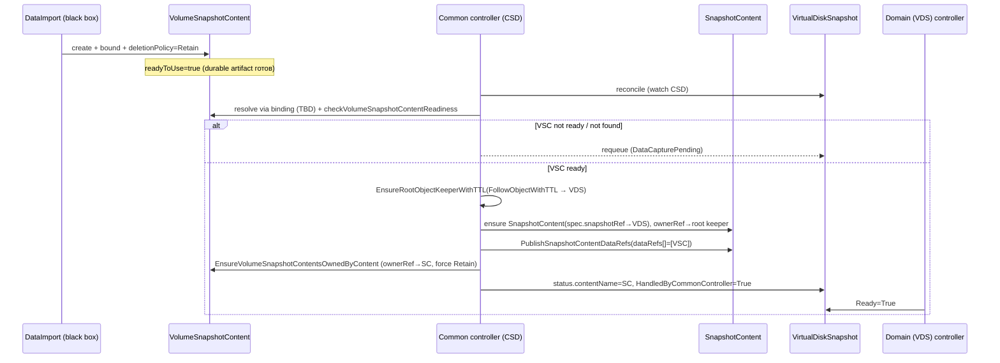

# VDS data-artifact handoff — implementation plan (DataImport = black box)

**Status:** Implementation plan / ТЗ. **Not yet normative.** После проработки OPEN-пунктов нормативная часть переносится в [`spec/system-spec.md`](../spec/system-spec.md) + ADR. Зависимый контракт — [`vds-import-restore-contract.md`](./vds-import-restore-contract.md) (концептуальная схема); этот документ **не противоречит** ему, а детализирует механику вокруг готового data-артефакта.

## 0. Scope и фиксированные допущения

**В этой итерации НЕ проектируем DataImport API.** DataImport трактуется как **black box**, который в какой-то момент:
- создал durable `VolumeSnapshotContent` (далее VSC) — backend snapshot handle;
- сделал `deletionPolicy=Retain` на VSC (нижний слой удержания backend-снимка);
- опубликовал имя VSC где-то в своём `status` (сейчас — `status.volumeSnapshotContentName`).

**Намеренно отложено (отдельный API review):** семантика `DataImport.spec.targetRef`, `spec.dataArtifactType`, `consumerRef/snapshotRef`, `status.dataArtifactRef`, condition `DataArtifactReady`. Здесь это абстрагируется как **binding mechanism (TBD)** — механизм, который позволяет общему контроллеру по VDS найти его готовый VSC. Конкретная форра (поле / annotation / отдельный CRD) выбирается позже; план не зависит от выбора.

**Что проектируем:** всё «вокруг события “VSC готов”»:
1. VirtualDiskSnapshot (virtualization) — API + контроллер.
2. Common controller / CSD — обнаружение готовности, создание SnapshotContent, dataRefs, watch/triggers, boundary.
3. ObjectKeeper / retention — execution vs lifecycle keeper, кто создаёт/удаляет, handoff ownerRef.
4. VSC lifecycle — создание, Retain, ownerRef, удаление temporary VS, кто удаляет VSC и backend-снимок.
5. Handoff protocol — sequence, отсутствие race, отсутствие orphan, retry/partial-failure.
6. Open decisions.

## 0.1. Реализовано сейчас (storage-volume-data-manager, baseline)

Локально в модуле `storage-volume-data-manager` (DataImport controller, `kind=VolumeSnapshot`) уже реализован **execution-baseline**, на который опирается handoff ниже:

- VSC создаётся (через временный VolumeSnapshot из промежуточного PVC), `deletionPolicy=Retain` фиксируется до `Completed`.
- На первом reconcile создаётся **execution `ObjectKeeper`** (cluster-scoped, deterministic name `data-import-<DI.UID>`, `mode: FollowObject`, `followObjectRef → DataImport`); затем VSC получает `ownerRef → ObjectKeeper`.
- Логика владения VSC в DataImport **намеренно тупая и локальная**: единственный допустимый владелец — собственный ObjectKeeper (наш → no-op; пусто → ставим; чужой → ошибка/не перетираем). DataImport **не знает** про SnapshotContent / parent snapshot / future handoff / `*Snapshot` kinds / CSD.
- **Семантика `Completed=True` = execution completed** (данные загружены, VS+VSC созданы, Retain, VSC под keeper'ом), **не** durable-handoff. Retain защищает только backend-снимок; до handoff жизненный цикл объекта VSC следует за DataImport (удаление DataImport удаляет объект VSC).

**Открытые TODO для следующей фазы (handoff), не реализованы в baseline:**
- **Handoff contract:** кто (common/CSD контроллер) и когда переставляет `ownerRef ObjectKeeper → SnapshotContent`, и что считается success (adopted). Детализация — §6.1; владелец-вопрос — O-RET-1.
- **Судьба temporary VolumeSnapshot:** удалять после handoff (durable only VSC) vs оставлять как discoverable object — O-VSC-1 (см. §5).
- **TTL-guard:** запрет TTL-удаления DataImport до handoff (аналог `finalizeMCRIfCheckpointHandedOff`) — O-TTL-1.

## 1. Карта переиспользования (что уже есть в state-snapshotter)

Большая часть механики реализована для пути `VolumeCaptureRequest` (VCR) и переиспользуется один-в-один. Это **прямой прототип** для DataImport.

| Возможность | Существующий код | Переиспользование для DataImport/VDS |
|---|---|---|
| Запись `SnapshotContent.status.dataRefs[]` | `snapshotcontent/datarefs_publish.go: PublishSnapshotContentDataRefs` | как есть |
| Handoff VSC ownerRef → SnapshotContent + force `Retain` | `snapshotcontent/datarefs_publish.go: EnsureVolumeSnapshotContentsOwnedByContent` | как есть (VSC-источник не важен) |
| Single lifecycle-owner, замена keeper→content, конфликт-детект | `common/lifecycle_ownerrefs.go: EnsureLifecycleOwnerRef`, `lifecycleOwnerRefs`, `isLifecycleOwnerRef` | как есть |
| Root ObjectKeeper `FollowObjectWithTTL` → root snapshot | `common/lifecycle_ownerrefs.go: EnsureRootObjectKeeperWithTTL` | применить к VDS как root |
| Execution ObjectKeeper `FollowObject` → request, и «не завершать request до handoff» | `manifestcapture/checkpoint_controller.go` (создание keeper, `finalizeMCRIfCheckpointHandedOff`) | паттерн для execution-keeper над VSC |
| Readiness VSC; «удаляемый VSC = ArtifactMissing» | `snapshotcontent/data_readiness.go: resolveDataReadiness`, `checkVolumeSnapshotContentReadiness` | как есть |
| Запрет публиковать execution-request как durable artifact | `data_readiness.go: dataArtifactExecutionRequestKinds` (уже включает `DataImport`) | как есть — durable artifact это VSC, не DataImport |

**Вывод:** generic-слой (SnapshotContent + dataRefs + handoff + keeper) уже умеет принимать VSC. Недостающее — это (а) **VDS-домен** (API + контроллер + CSD-регистрация) и (б) **корреляция «VDS → его готовый VSC»** (binding mechanism, TBD).

## 2. VDS (virtualization) — API и контроллер

> Боевой `VirtualDiskSnapshot` в этой задаче не трогаем; контракт демонстрируется demo-контроллером (как в существующем `internal/controllers/demo/`). Ниже — требования к доменному объекту/контроллеру независимо от того, demo это или прод.

### 2.1. API (status/conditions)

Минимально необходимое на restore-пути:

```yaml
status:
  contentName: vds-1-sc            # ссылка на generic SnapshotContent (заполняет common controller)
  conditions:
    - type: HandledByCommonController   # выставляет common controller
    - type: Ready                       # derived доменным контроллером
```

- `status.contentName` — generic `SnapshotContent`, который common controller создал/связал. Пишет **common controller** (он владелец этого факта), либо доменный контроллер отражает из своего наблюдения — см. §6 O-VDS-1.
- `conditions[HandledByCommonController]` — общий контроллер обработал VDS (snapshot-tree построен, dataRefs готовы). Пишет common controller.
- `conditions[Ready]` — доменный derived-итог (данные готовы и адоптированы). Пишет доменный контроллер.

**Сигнал «данные готовы» НЕ обязан жить в condition на VDS, который пишет DataImport.** Это разруливается binding mechanism (TBD): common controller сам резолвит «VDS → VSC» и проверяет готовность VSC через `data_readiness.go`. То есть готовность определяется **по факту VSC**, а не по слову DataImport. Это устойчивее и не требует, чтобы кто-то писал condition в чужой объект.

### 2.2. Контроллер (доменный)

Обязанности (domain boundary):
- резолвит источник данных (`VDS → binding → VSC`) — но НЕ строит snapshot-tree;
- выставляет доменные conditions (`Ready` и т.п.) на основе `status.contentName` / `HandledByCommonController`;
- НЕ создаёт SnapshotContent, НЕ трогает ownerRef VSC, НЕ создаёт ObjectKeeper — это всё common controller.

### 2.3. Lifecycle VDS во время restore

1. VDS создан пользователем, источник данных указан (binding TBD).
2. Common controller обнаруживает VDS (CSD), резолвит VSC, ждёт `readyToUse`.
3. Common controller строит snapshot-tree (см. §3) и пишет `VDS.status.contentName` + `HandledByCommonController=True`.
4. Доменный контроллер выставляет `Ready=True`.
5. При удалении VDS — retention по ObjectKeeper (§4): данные могут пережить VDS на TTL.

## 3. Common controller / CSD integration

### 3.1. Как CSD обнаруживает готовность данных для VDS

- Common controller наблюдает VDS через CSD (как уже наблюдает доменные snapshot-объекты).
- По VDS резолвит готовый VSC через **binding mechanism (TBD)**.
- Готовность VSC проверяет существующим `checkVolumeSnapshotContentReadiness` (`status.readyToUse==true`, не в состоянии удаления).
- Триггеры reconcile (watch):
  - watch VDS (CSD) — основной;
  - watch VSC — чтобы реагировать на переход `readyToUse: false→true` и на удаление (re-handoff/самолечение). Прецедент — `data_readiness`/self-heal в `snapshotcontent`.
  - **НЕ watch DataImport напрямую** в generic-контроллере: durable-артефакт это VSC; DataImport — execution-request (он уже в `dataArtifactExecutionRequestKinds`, т.е. сознательно не трактуется как artifact).

### 3.2. Когда создаётся SnapshotContent и как пишется dataRef

Порядок (reconcile VDS):
1. VSC найден и `readyToUse=true`.
2. Ensure root `ObjectKeeper(FollowObjectWithTTL → VDS)` — `EnsureRootObjectKeeperWithTTL` (§4).
3. Create/ensure `SnapshotContent(vds-1-sc)` с `spec.snapshotRef → VDS`, ownerRef → root keeper (на старте), finalizer `parent-protect`.
4. Сформировать `dataRefs[]` = `[{ target: VDS-source, artifact: { apiVersion: snapshot.storage.k8s.io/v1, kind: VolumeSnapshotContent, name: vsc-1 } }]` и записать через `PublishSnapshotContentDataRefs`.
5. Handoff: `EnsureVolumeSnapshotContentsOwnedByContent` — переставляет ownerRef VSC → SnapshotContent и форсит `Retain`.
6. Записать `VDS.status.contentName = vds-1-sc`, `HandledByCommonController=True`.

### 3.3. Boundary domain ↔ common

| Делает доменный (virtualization) | Делает common (state-snapshotter/CSD) |
|---|---|
| создаёт/валидирует VDS, доменные conditions, `Ready` | создаёт SnapshotContent, пишет `dataRefs[]`, `status.contentName` |
| резолвит «откуда данные» доменно | резолвит VSC-готовность, делает handoff ownerRef, управляет ObjectKeeper |
| не трогает VSC/keeper/tree | не знает доменную семантику VDS глубже `snapshotRef` |

## 4. ObjectKeeper / retention

### 4.1. Два вида keeper

| Keeper | mode | followObjectRef | назначение | кто создаёт | кто удаляет |
|---|---|---|---|---|---|
| **execution keeper** | `FollowObject` | → request (DataImport) **или** временный держатель | держит VSC живым, пока идёт upload и до handoff; уходит вместе с request | тот, кто владеет execution-фазой (см. O-RET-1) | GC по исчезновению followObject |
| **lifecycle/root keeper** | `FollowObjectWithTTL` | → VDS (root) | «корзина данных»: держит SnapshotContent (и через него VSC) на TTL после удаления VDS | common controller (`EnsureRootObjectKeeperWithTTL`) | GC через TTL после исчезновения VDS |

### 4.2. Handoff ownerRef (порядок владения VSC)

```
фаза upload:     VSC.ownerRef = execution keeper        (lifecycle owner = keeper)
после handoff:   VSC.ownerRef = SnapshotContent         (lifecycle owner = content)
SnapshotContent.ownerRef = root keeper (FollowObjectWithTTL → VDS)
```

Инвариант **single lifecycle owner** обеспечивает `EnsureLifecycleOwnerRef` (`isLifecycleOwnerRef` = ObjectKeeper | SnapshotContent | *Snapshot): на VSC одновременно допустим один lifecycle-owner; замена keeper→content атомарна на уровне patch и идемпотентна.

### 4.3. Кто что удаляет
- execution keeper: GC, когда исчез его followObject (после успешного handoff request может завершиться/удалиться).
- root keeper: GC по TTL после удаления VDS → каскадно SnapshotContent → каскадно VSC (если нет других lifecycle-owner).
- backend snapshot: удаляется CSI-драйвером при удалении VSC **только если** `deletionPolicy=Delete`. У нас `Retain` — см. §5 / O-RET-2.

> **OPEN (O-RET-1):** в каноне execution keeper должен следовать за DataImport (`FollowObject → DataImport`). Но т.к. DataImport здесь black box и его API не трогаем, на этом этапе execution-keeper над VSC создаёт **common controller** при первом обнаружении готового VSC (followObjectRef → VDS как временный держатель), и сразу делает handoff на SnapshotContent. Привязка keeper к DataImport переносится в фазу DataImport API review.

## 5. VSC lifecycle

| Этап | Действие | Кто |
|---|---|---|
| создание VSC | bound из temporary VolumeSnapshot (backend snapshot handle) | DataImport (black box) |
| pin `deletionPolicy=Retain` | нижний слой: backend-снимок не удаляется при удалении VS | DataImport (уже делает) + повторно форсится при handoff (`EnsureVolumeSnapshotContentsOwnedByContent`) |
| ownerRef (upload) | → execution keeper | владелец execution-фазы (см. O-RET-1) |
| ownerRef (handoff) | → SnapshotContent | common controller |
| удаление temporary VolumeSnapshot | namespaced VS можно удалять **после** bound VSC + Retain + handoff ownerRef | см. O-VSC-1 |
| удаление VSC | каскадно при GC lifecycle-owner (SnapshotContent → root keeper TTL) | GC |
| cleanup backend snapshot | при фактическом удалении VSC, согласно `deletionPolicy` | CSI driver |

> **OPEN (O-VSC-1):** сейчас DataImport **намеренно сохраняет** temporary VolumeSnapshot (`data_import_resource.go: cleanupDataImport`, «the VolumeSnapshot itself is kept»), и VS создаётся **без ownerRef** (`volume_snapshot.go: EnsureVolumeSnapshot`). В каноне после handoff VSC на SnapshotContent namespaced VS больше не нужен и должен удаляться, иначе остаётся orphan VS. Но удалять VS должен тот, кто знает, что handoff состоялся — это пересекается с DataImport API (отложено). Безопасный промежуточный вариант: VS оставляем (он не держит backend-снимок, т.к. durable-слой — VSC+Retain), помечаем как known orphan-риск.

## 6. Handoff protocol (sequence) + гарантии

### 6.1. Sequence



### 6.2. Отсутствие race
- **Источник истины готовности — сам VSC** (`readyToUse`, отсутствие deletionTimestamp), а не сообщение от DataImport. Поэтому нет гонки «сигнал пришёл раньше артефакта».
- Все мутации идемпотентны: `Ensure*` хелперы делают get→compare→patch с `RetryOnConflict` (`datarefs_publish.go`) и no-op при совпадении.
- Single lifecycle-owner инвариант (`lifecycleOwnerRefs`) детектит конфликт двух владельцев и не затирает чужой ownerRef молча (возвращает ошибку → requeue).

### 6.3. Отсутствие orphan VSC
- VSC всегда имеет ровно один lifecycle-owner: до handoff — execution keeper, после — SnapshotContent. Промежутка «без владельца» нет (handoff = добавить нового lifecycle-owner и убрать старого в одном patch).
- Если handoff упал между «dataRefs записаны» и «ownerRef переставлен» — при следующем reconcile `EnsureVolumeSnapshotContentsOwnedByContent` доделает (идемпотентно); self-heal по watch VSC.
- Удаляемый VSC не публикуется как Ready (`checkVolumeSnapshotContentReadiness` → ArtifactMissing), поэтому SnapshotContent не «застрянет» Ready над уходящим артефактом.

### 6.4. Retry / partial failure
| Сбой | Поведение |
|---|---|
| SnapshotContent создан, dataRefs не записаны | reconcile повторит `PublishSnapshotContentDataRefs` |
| dataRefs записаны, ownerRef не переставлен | reconcile повторит handoff; до этого VSC держит execution keeper (не orphan) |
| VDS удалён до handoff | root keeper ещё не создан/уже GC; VSC держит execution keeper до своего GC; backend защищён `Retain` |
| VSC удаляется в процессе | трактуется как ArtifactMissing; tree не помечается Ready |
| binding не резолвится | requeue, без создания SnapshotContent |

## 7. Open decisions (не защёлкнуто)

- **O-BIND-1 (главный):** конкретный binding mechanism «VDS → его готовый VSC». Варианты: поле в DataImport (отложено), annotation, отдельный CRD, либо резолв через VDS.spec.dataSource → DataImport.status.volumeSnapshotContentName. Влияет на §3.1 и §2.1. До выбора — абстракция.
- **O-RET-1:** кто создаёт execution keeper над VSC и на кого `FollowObjectRef` в текущей фазе (common controller с `→VDS` как временный держатель) vs канон (`→DataImport`). См. §4.2.
- **O-RET-2:** достаточно ли ownerRef-удержания (keeper/SnapshotContent) или `deletionPolicy=Retain` на VSC обязателен как нижний слой для backend-снимка (повтор O3 из контракт-дока). Текущее допущение: Retain обязателен.
- **O-VDS-1:** кто пишет `VDS.status.contentName` — common controller напрямую (cross-write в домен) или доменный контроллер отражает наблюдение. Связано с принципом «каждый пишет свой статус».
- **O-VSC-1:** удаление temporary namespaced VolumeSnapshot после handoff и кто его инициирует (см. §5).
- **O-TTL-1:** запрет TTL-удаления execution-request до handoff (в MCR это `finalizeMCRIfCheckpointHandedOff`); для DataImport — часть отложенного API.
- **O-CSD-1:** точная регистрация VDS в CSD (GVK, RBAC на VDS/VSC/SnapshotContent/ObjectKeeper для common controller).

## 8. Разбивка задач

| Кому | Что |
|---|---|
| **Virtualization (домен / demo)** | VDS `status.contentName` + conditions `HandledByCommonController`/`Ready`; доменный контроллер (резолв источника, derived Ready); НЕ трогает tree/keeper/VSC |
| **state-snapshotter (common/CSD)** | watch VDS (CSD) + watch VSC; резолв VSC по binding; `EnsureRootObjectKeeperWithTTL`; create SnapshotContent(`snapshotRef→VDS`); `PublishSnapshotContentDataRefs`; `EnsureVolumeSnapshotContentsOwnedByContent` (handoff+Retain); запись `VDS.status.contentName`; RBAC |
| **Отложено (DataImport API review)** | binding mechanism, execution-keeper `→DataImport`, двухфазность `DataArtifactReady`/`Completed`, TTL-guard до handoff, удаление temporary VS |

## 9. Связь с другими документами

- Концептуальный контракт и роли — [`vds-import-restore-contract.md`](./vds-import-restore-contract.md).
- Нормативка после проработки OPEN — [`spec/system-spec.md`](../spec/system-spec.md).
- Прототип механики (VCR-путь) — `images/state-snapshotter-controller/internal/controllers/snapshotcontent/` и `.../common/lifecycle_ownerrefs.go`.
